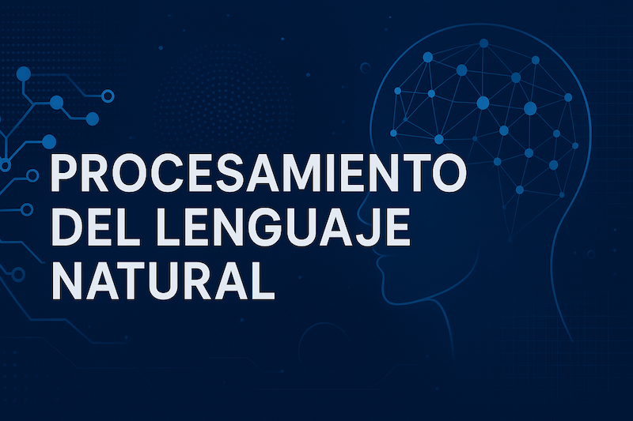

## Especialización en Inteligencia Artificial 
## Materia de Procesamiento del Lenguaje Natural


### Alumno: Martin Brocca

### Contenido: 


[desafío 1](./desafios/desafio_1/Desafio_1.ipynb) :
    - Explorar cómo representar y analizar texto, primero, vectorizar documentos y medir su similaridad para ver si coincide con el sentido del contenido y las etiquetas. Luego, armar un clasificador por prototipos comparando documentos de test con los de entrenamiento. Después, entrenar modelos de Naïve Bayes (Multinomial y ComplementNB) ajustando parámetros para mejorar el f1-score. Finalmente, trabajar con la matriz término-documento para estudiar la similaridad entre palabras y reflexionar sobre su interpretación.
  
[desafío 2](./desafios/Desafio_2.ipynb) :
    - tbd
  

### Estructura del repositorio:
```bash
.
├── desafios
│   ├── desafio_1
│   │   └── Desafio_1.ipynb
│   └── desafio_2
├── images
│   └── nlp.png
└── README.md
